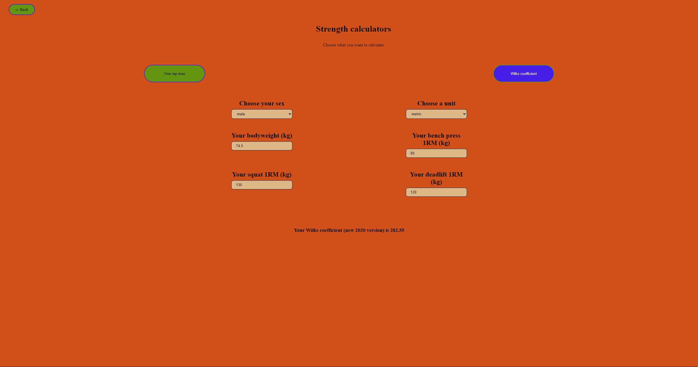

# Fitness Calculators — fitness-calc

A small, fast React + Vite app with a collection of commonly used fitness calculators:

- Body composition: BMI, Body Fat percentage, FFMI (and adjusted FFMI)
- Strength: One-Rep-Max (Epley) and Wilks coefficient (2020 formula)

The app is focused on simple, client-side calculations with a clean UI and support for metric and imperial units.

## Table of Contents
- [Tech stack](#tech-stack)
- [Features](#features)
- [Installation](#installation)
- [Project Structure](#project-structure)
- [Scripts](#scripts)
- [Screenshots](#screenshots)
- [License](#license)
- [Contributions](#contributions)
- [Author & Contact](#author--contact)

## Tech stack

- React 19 + React Router
- Vite for fast development and build
- `powerlifting-formulas` for Wilks 2020 calculation

## Features

- Multiple calculators grouped under Fat and Strength pages
- Unit switching (metric / imperial) across calculators
- Sex-aware bodyfat calculator (different formulas for male/female)
- FFMI with adjustment for height
- One-rep-max using the Epley formula
- Wilks coefficient calculation using the `powerlifting-formulas` package

## Installation

Make sure you have Node.js installed (v16+ recommended).

1. Clone the repository
```bash
git clone https://github.com/Sebastijan-Dominis/fitness-calc
cd fitness-calc
```

2. Install the dependencies
```bash
npm install
```

3. Start the server
```bash
npm run dev
```

## Project structure

- `src/pages/` — top-level routes
- `src/components/` — calculators and UI building blocks

## Scripts
Available npm scripts (from `package.json`):

- `npm run dev` — Start Vite dev server
- `npm run build` — Build production bundle (runs TypeScript build first)
- `npm run preview` — Serve built production files locally
- `npm run lint` — Run ESLint checks

## Screenshots




## License

See the `LICENSE` file in this repository for license details.

## Contributions
- Feel free to contribute if you wish. Open an issue or submit a pull request with a clear description of the change.

## Author & Contact
- Author: Sebastijan Dominis
- Contact: sebastijan.dominis99@gmail.com
